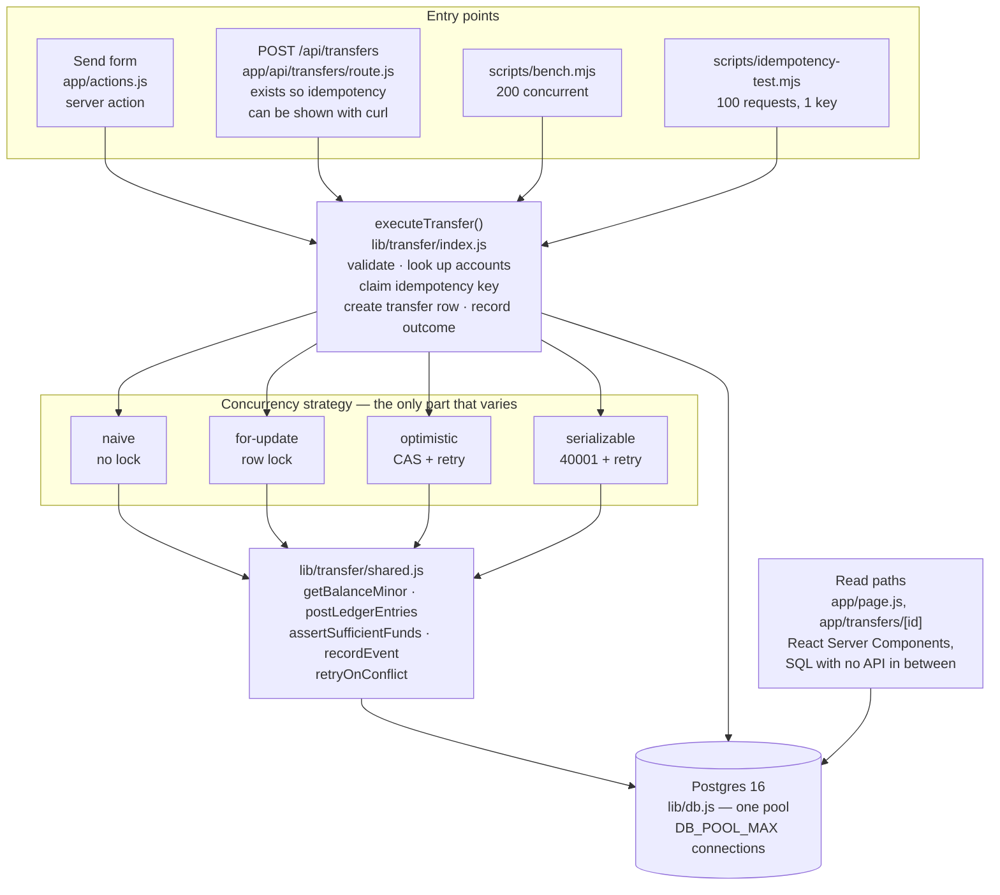
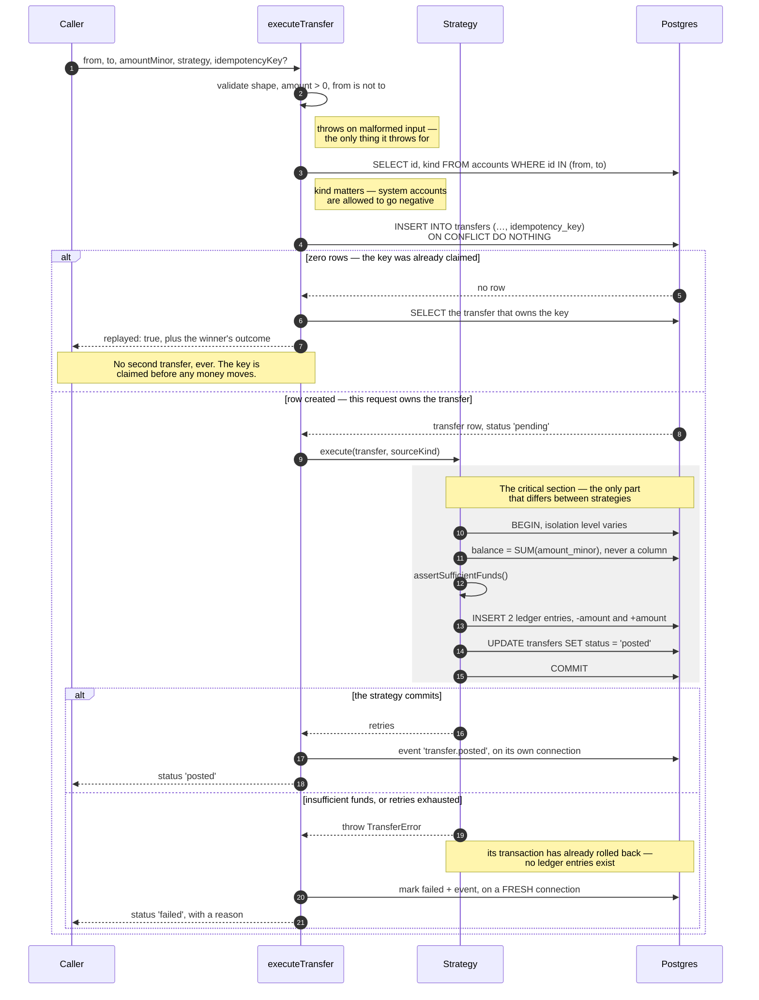
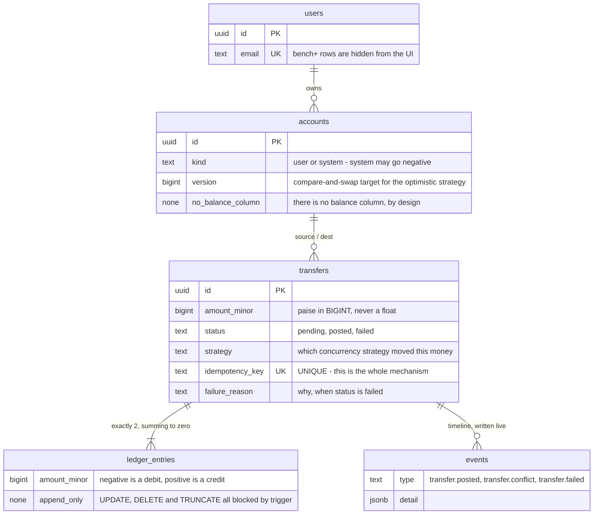

# Flux

A double-entry ledger where **balances are derived, never stored**, built to answer one question
with measurements instead of opinions:

> What actually happens to a wallet when 200 people spend the same rupee at the same time?

This is not a wallet app. It is a concurrency experiment with a UI attached.

---

## The result

200 concurrent transfers of ₹10, against a single account holding ₹1,000. There is only enough
money for 100 of them. A correct system posts exactly 100 and rejects the other 100.

| Strategy     | Overdraft @ 200 concurrent | Successful | Throughput | Retries |
|--------------|----------------------------|------------|------------|---------|
| naive        | **−₹220.00**               | **122**    | 453.0 tps  | 0       |
| for-update   | ₹0.00                      | 100        | 375.2 tps  | 0       |
| optimistic   | ₹0.00                      | 100        | 91.2 tps   | 938     |
| serializable | ₹0.00                      | 100        | 77.3 tps   | 1082    |

<sub>Postgres 16, Node 22, 40-connection pool, single machine. Reproduce with `npm run bench`.</sub>

Run it again and the exact overdraft moves — it lands between roughly −₹200 and −₹250 on this
machine, because it depends on how the scheduler interleaves 200 requests. What does not move is the
shape of the table: naive overdraws on every run, and the other three post exactly 100 and finish at
exactly ₹0, every time.

The naive strategy checked the balance before every single one of those 122 transfers, and every
check passed. That is the whole point: **the check was not wrong, the timing was.** Between reading
the balance and writing the entry, dozens of other requests read the same balance and reached the
same conclusion.

### The bug scales with your success

The overdraft is not a fixed quantity. It is proportional to how much real concurrency you have,
which means it gets worse exactly when traffic grows:

| Pool size (real concurrency) | Posted | Overdraft |
|------------------------------|--------|-----------|
| 10                           | 107    | −₹70.00   |
| 40                           | 122    | −₹220.00  |
| 80                           | 136    | −₹360.00  |

Load-testing this on a laptop with 10 connections would show a ₹70 discrepancy that looks like a
rounding bug worth deferring. The same code in production is a hole in the balance sheet.

---

## If you only read five things

- **[Double-entry did not prevent the overdraft](#two-invariants-and-only-one-of-them-is-free)** —
  the global sum stayed at exactly 0 even during the failing run, because every transfer still wrote
  a matched debit and credit. Structure and business rules fail independently, and conflating them
  is how a ledger gets called "safe" when it is not.

- **[The fastest strategy is the broken one](#which-one-would-i-actually-ship)** — naive wins on
  throughput because it skips the coordination correctness requires. Any benchmark that ranks these
  by speed alone crowns the wrong winner. The section picks one to ship and then argues against it.

- **[The ledger refuses TRUNCATE, not just UPDATE and DELETE](#the-ledger-is-append-only-enforced-by-the-database)** —
  row-level triggers do not fire on TRUNCATE, so without a statement-level trigger one command
  erases every transaction and the other two triggers never run. This is also why the benchmark
  creates fresh accounts instead of resetting.

- **[One execution path, four swappable strategies](#the-shape-of-the-system)** — the diagrams show
  what the benchmark actually holds constant. Validation, idempotency, ledger writes and the event
  log are shared code; only the guard around the critical section changes, which is what makes the
  comparison fair.

- **[The bug grows with your traffic](#the-bug-scales-with-your-success)** — −₹70 at ten concurrent
  connections, −₹360 at eighty. It is invisible in low-concurrency testing and worst exactly when
  you succeed.

---

## Two invariants, and only one of them is free

`SELECT * FROM ledger_invariant;` after the entire benchmark run:

```
global_sum_minor       0     <- money created or destroyed
unbalanced_transfers   0     <- transfers whose entries do not sum to zero
overdrawn_accounts     1     <- accounts pushed below zero
total_overdraft_minor  -22000
```

Read that carefully, because it is the most useful thing in this repository:

**Double-entry held perfectly, even under the broken strategy.** No money was created or destroyed.
Every transfer still wrote a matching debit and credit summing to zero, so the global sum never
moved off zero for an instant.

What broke was the *business* rule — an account went below zero. Double-entry cannot catch that, and
no amount of schema design will. Only concurrency control will.

> Double-entry stops you from **losing** money. It does nothing to stop you from **spending the same
> money twice**.

Most "ledger" tutorials conflate these two and then claim double-entry made the system safe.

---

## Idempotency

The scenario every payments interviewer asks about: the response is slow, the user taps again, the
mobile client retries on timeout, a proxy replays the request. Five identical requests are in flight
and the customer must be charged once.

The whole mechanism is a `UNIQUE` constraint and one statement:

```sql
INSERT INTO transfers (..., idempotency_key)
VALUES (..., $5)
ON CONFLICT (idempotency_key) DO NOTHING
RETURNING *;
```

Zero rows back means someone else already claimed this key, so we return *their* transfer instead of
starting a second one. The key is claimed **before any money moves**, so a duplicate can never reach
the ledger.

`npm run test:idempotency` — 100 concurrent requests, one key:

```
PASS  transfer rows created for the key            expected 1, got 1
PASS  ledger entries written (1 debit + 1 credit)  expected 2, got 2
PASS  distinct transfer ids returned to callers    expected 1, got 1
PASS  callers served a replay of the winner        expected 99, got 99
PASS  source debited exactly once                  expected 10000, got 10000

balance: ₹1,000.00 -> ₹900.00
1 request did the work, 99 got the same result back without redoing it.
```

Over HTTP, same key twice:

```console
$ curl -X POST localhost:3000/api/transfers -H 'idempotency-key: demo-1' -d '{...}'
{"transferId":"0b8b3776-...","status":"posted","replayed":false,"durationMs":21}

$ curl -X POST localhost:3000/api/transfers -H 'idempotency-key: demo-1' -d '{...}'
{"transferId":"0b8b3776-...","status":"posted","replayed":true,"durationMs":6}
```

**One honest caveat.** If the duplicate arrives while the winner is still in flight, the replay
returns `status: "pending"` rather than a settled result. A production system would poll briefly or
return 409 and let the caller re-ask. What it must never do — and this does not — is start a second
transfer.

---

## Which one would I actually ship?

**`SELECT … FOR UPDATE`.** It is correct, it is the fastest of the three correct strategies here, and
it wastes no work.

**The fastest strategy overall is the broken one**, and that is not a coincidence worth explaining
away. Naive wins at 453 tps because it skips the coordination that correctness requires. Every
concurrency-control mechanism is a way of buying correctness with throughput; naive simply declines
to buy any. Any benchmark that ranks strategies by throughput alone will always crown the wrong one.

Against the other two:

- **Optimistic (91 tps, 938 retries)** is being tested in its worst case. One hot account and 200
  contenders means a conflict is not an exception, it is the norm — 938 retries across 200 transfers
  is nearly five wasted attempts each. OCC is a bet that collisions are rare, and here that bet is
  guaranteed to lose.
  On traffic spread across many accounts it would be excellent, and it is the only one of the four
  that would survive being split across two databases, since it needs no shared lock.

- **Serializable (77 tps, 1082 retries)** has the best-looking code in the repository: it is the
  naive implementation, unchanged, with one different word on the `BEGIN`. The database supplies the
  correctness argument instead of me. That is worth a great deal on a team where a dozen developers
  write transactions and nobody hand-verifies each one's locking. The cost is that **every caller
  needs a retry loop** — `40001` can abort any transaction at any time, including one that did
  nothing wrong. Ship SERIALIZABLE without that loop and it surfaces as random production errors.

The case against my own pick: `FOR UPDATE` fully serialises transfers out of one account, so a
celebrity account becomes a queue. And the lock is held until commit — put a slow call inside that
transaction and every waiting transfer pays for it. It is the right default *and* the one that fails
worst when someone adds an HTTP call inside the transaction two years from now.

One more caveat on the throughput numbers: this benchmark is deliberately the worst case for all
four, since every transfer targets the same row. Real traffic spreads across accounts, where the
conflict-detecting strategies rarely conflict and the gap narrows sharply.

---

## How it works

### The shape of the system

Four entry points, one execution path, one database. There is no service layer and no API between
the pages and Postgres — the pages *are* the service layer.



The important thing in that picture is what is *not* branching: *everything above the strategy box
is identical for all four runs of the benchmark.* Same validation, same idempotency, same ledger
writes, same event log. The only variable is how the critical section is guarded, which is what
makes the benchmark a fair comparison rather than four different programs.

### The path of one transfer



Three steps in there are load-bearing, and all three are easy to get wrong:

**The idempotency key is claimed before any money moves.** It is a `UNIQUE` column and an
`ON CONFLICT DO NOTHING` — not a cache lookup, not a check-then-insert. Two identical requests
racing at the same instant cannot both get past that step, because the *database* picks the winner.
The loser is handed the winner's outcome. This is the mechanism `npm run test:idempotency` fires 100
concurrent requests at.

**A business failure is a return value, not an exception.** `executeTransfer` *returns*
`{ status: 'failed' }` for insufficient funds or exhausted retries, and only *throws* for a
malformed request — unknown account, bad amount, unknown strategy. Both callers depend on that
split: the server action renders "insufficient funds" as an ordinary outcome, and the API route maps
it to a normal response rather than a 500. Backwards, and "you don't have the money" becomes a
crash.

**The failure is recorded on a new connection.** By the time `executeTransfer` learns the strategy
failed, that strategy's transaction has already rolled back — writing the explanation *into* that
transaction would roll the explanation back with it. Retry events are written the same way, on their
own connection, which is the only reason the timeline can show attempts that never committed.

### The data model



Two views do the job a `balance` column would do badly:

| View | What it answers |
|---|---|
| `account_balances` | `SUM(amount_minor)` per account — the only definition of a balance in the system |
| `ledger_invariant` | Both invariants at once, queryable at any instant: global sum, unbalanced transfers, and overdrawn **user** accounts |

`ledger_invariant` reports the two invariants separately on purpose, because
[they fail independently](#two-invariants-and-only-one-of-them-is-free), and the entire result of
this project lives in the gap between them.

### Where the concurrency actually lives

`DB_POOL_MAX` is not a tuning knob, it is the independent variable of the experiment. `lib/db.js`
opens exactly one pool per process, and its size is the real ceiling on how many transfers are
genuinely simultaneous *inside Postgres* — everything beyond it queues in the client, where it
cannot race. Firing 200 requests at a pool of 10 does not test 200-way concurrency; it tests 10-way
concurrency twenty times over, which is exactly why
[the overdraft grows with the pool](#the-bug-scales-with-your-success).

The same file registers a `pg` type parser for type oid 20, so `BIGINT` arrives as a JavaScript
number rather than a string. Without it, `balance >= amount` silently becomes a *string* comparison,
and `"900" >= "1000"` is true. Amounts are paise in `BIGINT` everywhere, and JS integers are exact to
2^53 — about 90 trillion rupees — so the conversion is safe.

### Module map

| Path | Responsibility |
|---|---|
| `lib/db.js` | The pool, the BIGINT parser, `withTransaction(fn, { isolationLevel })` |
| `lib/transfer/index.js` | `executeTransfer` — everything that does not vary — plus the strategy registry |
| `lib/transfer/shared.js` | The mechanics all four strategies reuse, so each strategy file stays short enough to read beside the others |
| `lib/transfer/*.js` | One file per strategy. Add a fifth by exporting `{ name, label, description, execute }` and adding one line to `index.js`; the UI and the benchmark pick it up with no other change |
| `db/001_schema.sql` | Tables, the two views, and the three append-only triggers |
| `scripts/bench.mjs` | The deliverable. Overwrites `docs/benchmark-results.md` |
| `app/` | App Router. Server Components read SQL directly; the send form posts to a server action |

### There is no balance column

Not in `accounts`, not anywhere. Grep for it. A balance is a `SUM` over the ledger, exposed as a
view:

```sql
CREATE VIEW account_balances AS
SELECT a.id, COALESCE(SUM(le.amount_minor), 0)::BIGINT AS balance_minor
FROM accounts a
LEFT JOIN ledger_entries le ON le.account_id = a.id
GROUP BY a.id;
```

A stored balance is a cache of the transaction history, and like every cache it can disagree with
its source. If it cannot be stored, it cannot drift.

All money is **`BIGINT` paise**. No floats touch an amount at any point.

### The ledger is append-only, enforced by the database

Three triggers on `ledger_entries`: `BEFORE UPDATE`, `BEFORE DELETE`, and `BEFORE TRUNCATE`. The
third one matters more than it looks — row-level triggers do not fire on `TRUNCATE`, so without it
one statement erases every transaction in the system and the other two triggers never run.

Application-level rules get bypassed by a migration, by a psql session at 2am, by the next
developer. A trigger has to be dropped to be bypassed, and that shows up in a diff.

The consequence is visible in the benchmark: it **cannot** wipe the ledger between runs, so it
creates a fresh funded account pair for each strategy instead. History does not un-write.

### Four strategies, one interface

`lib/transfer/index.js` owns everything that does not vary: validation, idempotency, creating the
transfer row, recording the outcome. A strategy is handed an existing transfer and is responsible
for exactly one thing — moving the money without letting a concurrent transfer corrupt the balance.

| File | Mechanism |
|---|---|
| `naive.js` | Read, check, write. No transaction, no lock. **Broken on purpose.** |
| `for-update.js` | Exclusive row lock on the source account before reading. |
| `optimistic.js` | Version column + compare-and-swap; losers retry with jittered backoff. |
| `serializable.js` | Naive code at `SERIALIZABLE` isolation; retry on `40001`. |

Adding a fifth means writing one file and adding one line to a registry. The UI and the benchmark
pick it up automatically.

### The timeline is real data

`app/transfers/[id]` renders rows from an `events` table written *during* the transfer, not
reconstructed afterwards. Retry events are deliberately written on a **separate connection** — they
describe an attempt that was just rolled back, so writing them inside that transaction would erase
the evidence along with it. That is why a contended optimistic transfer shows all ten of its failed
attempts.

---

## Running it

Requires Postgres 16 and Node 22.

```bash
npm install
cp .env.example .env.local          # then set DATABASE_URL
npm run db:migrate                  # create db, apply schema, seed 4 users
npm run bench                       # the table above
npm run test:idempotency
npm run dev                         # http://localhost:3000
```

Useful flags:

```bash
npm run bench -- --strategies=naive --transfers=500
npm run db:reset                    # the only way to clear the ledger
```

`npm run bench` writes `docs/benchmark-results.md`.

### Or with Docker, without installing anything

```bash
docker compose up --build            # http://localhost:3000
docker compose run --rm bench        # the table above
docker compose run --rm idempotency
```

Details, and why the containerised numbers differ from the committed ones, in
[`docs/deployment.md`](docs/deployment.md).

---

## Deliberately not here

No dashboard, no charts, no budgeting, no split payments, no search, no notifications — and no auth.
Four users are seeded and a dropdown switches between them.

Auth is a solved problem I have implemented (JWT with rotating refresh tokens and reuse detection)
on two other projects. Building it a third time would have cost two days and demonstrated nothing
new. That time went into the benchmark instead, which is the only part of this repository that
teaches me something I could not have looked up.
